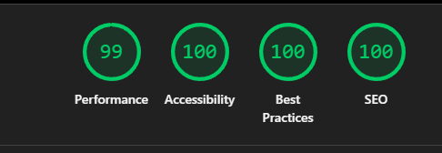

# NTD E-Commerce Challenge

**Repository:** [github.com/Tadeosoto/Code-Challenge-e-commerce-NTD-Fullstack-Tadeo-Soto](https://github.com/Tadeosoto/Code-Challenge-e-commerce-NTD-Fullstack-Tadeo-Soto)

Full-stack e-commerce demo for the NTD code challenge: product CRUD, CSV import with validation, search, shopping cart, and mock checkout — all running locally with PostgreSQL and Docker.

**Challenge CSV download date:** 2026-07-08

## What the challenge asks for

Per the NTD brief, the app must run locally with a real database, support CRUD, import the provided CSV, search products, simulate payment, expose UI for those flows, ship with Docker, and document decisions in this README. The focus is **judgment** (how you handle messy data and trade-offs), not checkbox completion.

This implementation goes beyond a single admin API key: it models a small marketplace with **Buyer**, **Seller**, and **Owner** roles so CRUD, approval, and shopping are separated the way a real store would operate.

## Features

- **Role-based demo** — Buyer (shop/checkout), Seller (own catalog CRUD), Owner (CSV import + approvals)
- **CSV import** with row-level validation, quarantine queue, and import report
- **Duplicate SKU handling** — variant suffixes instead of silent overwrites
- **Product search** by name, SKU, category, and description (approved products only in the shop)
- **Shopping cart** and **mock payment** with transactional stock decrement
- **Shopping chat assistant** (Gemini) — buyer Q&A grounded in APPROVED products only
- **PostgreSQL** + Prisma ORM, **Docker Compose** for one-command startup
- **Unit tests** for CSV parsing, normalization, SKU dedup, and validation

## Shopping chat assistant

Buyer-facing shopping helper powered by **Google Gemini**. It answers casual English questions (“for my pc”, “gift for mom”, “go camping”) using **only APPROVED catalog products**, with price/stock taken from the database — not invented by the model.

Floating **Chat** on public browse pages (home, `/shop`, `/cart`, About, etc.) opens a **docked bottom-right widget** so you can navigate while chatting. Hidden on `/login`, `/owner`, and `/seller`.

### Where the logic lives

| Layer | Path | Responsibility |
| ----- | ---- | -------------- |
| UI widget | `src/components/chat/shopping-assistant.tsx` | Docked chat panel, product cards, Add to cart / View shop |
| API route | `src/app/api/chat/route.ts` | `POST { messages[] }` → validates input, calls the service |
| Chat service | `src/lib/services/chat.service.ts` | Orchestrates catalog fetch, price filter, Gemini call, ID filtering |
| Intent / slang / typos | `src/lib/chat/query-expansion.ts` | Maps lifestyle phrases + synonyms + misspellings → search terms |
| Request schema | `src/lib/validators/chat.ts` | Zod validation for chat payloads |
| Shell wiring | `src/components/layout/app-shell.tsx` | Mounts the widget on browse layouts |

**Start here if you are another agent or a recruiter reviewing the feature:** `src/lib/chat/query-expansion.ts` (intent maps) and `src/lib/services/chat.service.ts` (end-to-end flow).

### How it works (request flow)

```text
User message
    │
    ▼
query-expansion.ts
  · typo fixes (e.g. "shose" → shoes)
  · slang / synonyms (music → speakers, earbuds)
  · phrase intents ("for my pc", "movie night", "walk the dog", …)
  · optional price intent (under $50, cheap, between X and Y)
    │
    ▼
searchProducts(..., approvedOnly=true)   ← same shop rules
  · merge hits, prefer in-stock, apply price filter
    │
    ▼
Gemini (system prompt + PROVIDED CATALOG JSON)
  · reply + productIds
    │
    ▼
chat.service.ts filters productIds to catalog IDs only
    │
    ▼
UI shows reply + cards (Add to cart needs Buyer session)
```

Lifestyle scenarios in `query-expansion.ts` are built from the challenge CSV: PC/office, gym/yoga/running, camping/hiking, kitchen/coffee, travel, beauty/sleep, home decor, movie/game night, gifts, school, cycling, pets, baby, rain, party, DIY, and more — each expands to related product search terms that actually exist in the catalog.

### Setup

1. Get an API key from [Google AI Studio](https://aistudio.google.com/apikey).
2. Add it to `.env` (and Docker if needed):

```bash
GEMINI_API_KEY=your-key-here
```

Optional: `GEMINI_MODEL` (defaults to `gemini-2.5-flash`, with automatic fallbacks if a model has no free-tier quota).

Without a key, the rest of the app still works; chat returns **503** with a clear message.

If chat returns **429** with `limit: 0`, that usually means the model is not enabled on your free-tier key (not that you “used too many messages”). Create a new key/project in AI Studio, set `GEMINI_MODEL=gemini-2.5-flash`, wait a minute, or check [rate limits](https://ai.dev/rate-limit).

### Safety / product boundaries

- Catalog context is loaded only via existing `searchProducts(..., approvedOnly=true)` — same rules as `/shop`.
- The model never invents prices/stock; replies are grounded in PROVIDED CATALOG JSON.
- Product cards returned by the API are filtered to IDs that actually came from that catalog query.
- **Add to cart** uses the real cart context (Buyer session required). Checkout stays transactional on `/cart` — the LLM cannot mark payment complete.

## Lighthouse scores

Audited on the homepage (`http://localhost:3000`) with Chrome Lighthouse:

| Category       |   Score |
| -------------- | ------: |
| Performance    |  **99** |
| Accessibility  | **100** |
| Best Practices | **100** |
| SEO            | **100** |



Accessibility fixes applied: `aria-label` on icon-only header links (search, cart, login), and sufficient footer text contrast (`text-white/60` on charcoal instead of `/40`).

## Try the demo

1. Start the app (see [Run locally](#run-locally) or [Run with Docker](#run-with-docker)).
2. On first visit, sign in from the modal with the role dropdown (or **“I just want to see”** to browse without logging in).
3. **Owner** — import CSV at `/owner/import`, review/fix at `/owner/approvals`, edit/delete any product on `/shop`.
4. **Seller** — manage listings at `/seller/products`.
5. **Buyer** — search and buy at `/shop`, checkout at `/cart`, or ask the floating **Chat** assistant about approved products.

**Demo credentials**:

- Buyer: `buyer` / `buyer123`
- Seller: `seller` / `seller123`
- Owner: `owner` / `owner123`

The login modal and `/login` page use a role dropdown with **Select role** as the placeholder. Once a role is selected, the username is fixed to the role name and the password is verified with `bcrypt` before creating the session cookie.

## Architecture

```text
Next.js App Router (pages + API routes)
        │
        ▼
Service layer (auth, products, import, orders, chat)
        │                    ▲
        │                    └── query-expansion (slang / scenarios)
        ▼
Prisma ORM + PostgreSQL (+ Gemini for shopping chat only)
```

## Roles and why CRUD is split

| Role       | Who they are   | What they can do                                                      | Why separate                                                                                         |
| ---------- | -------------- | --------------------------------------------------------------------- | ---------------------------------------------------------------------------------------------------- |
| **Buyer**  | Shopper        | Browse/search approved products, cart, mock checkout                  | Checkout must not depend on seller privileges; orders only reference live inventory                  |
| **Seller** | Vendor         | Create/update/delete **their** products                               | Listings start as `PENDING` until reviewed — prevents bad CSV-style data from going live from the UI |
| **Owner**  | Store operator | CSV import, approve/reject pending items, edit/delete **any** product | Mirrors “platform admin” without giving sellers import or approval power                             |

**API enforcement** (session cookie, not API keys):

| Action                | Buyer                       | Seller                       | Owner                          |
| --------------------- | --------------------------- | ---------------------------- | ------------------------------ |
| Search / view product | Yes (approved only in shop) | Yes                          | Yes                            |
| Create product        | No                          | Yes → `PENDING`              | No                             |
| Update product        | No                          | Own only → back to `PENDING` | Any; stays `APPROVED` if valid |
| Delete product        | No                          | Own only                     | Any                            |
| CSV import            | No                          | No                           | Yes                            |
| Approve / reject      | No                          | No                           | Yes                            |
| Place order           | Yes                         | No                           | No                             |

We chose three roles instead of one “admin key” because the challenge CSV is full of data-quality traps — the natural response is a **human approval queue**, not silently accepting or dropping rows. Sellers submitting through the UI follow the same path as bad import rows.

## Decisions and trade-offs

### Key dilemma: deny bad data vs quarantine for review

The CSV includes XSS payloads, SQL-like strings, invalid prices, and other trap rows. The strictest option is to **reject that data at the door** — skip the row or fail the import so nothing malicious or invalid ever touches the database.

We chose **quarantine instead** (`PENDING` + validation tags) because this is a **demo meant to show judgment**:

- Reviewers can see _which_ rows failed and _why_ (`XS-001`, `SQL-001`, `YM-015`, etc.)
- The owner workflow (fix → approve) mirrors how a real catalog team handles a bad supplier file
- The shop stays safe: only `APPROVED` products are searchable and purchasable

In production we would likely combine both approaches: **block obvious attacks at ingress**, log them, and only quarantine rows that are fixable data-quality issues (bad price, missing category). For the challenge, storing trap rows as pending makes the edge cases visible without ever executing them — React escapes on render, Prisma parameterizes queries, and the public shop never lists unapproved inventory.

| Decision                    | Rationale                                                                                             |
| --------------------------- | ----------------------------------------------------------------------------------------------------- |
| Next.js full-stack          | Single deployable unit; UI and API share types and services                                           |
| PostgreSQL + Prisma         | Relational orders/inventory; parameterized queries by default                                         |
| Session auth by role        | Fits demo UX, keeps a real login step, and is simpler than a shared secret for reviewers              |
| Quarantine invalid CSV rows | Import never fails entirely; owner sees tags and fixes data — shows judgment vs blind skip            |
| SKU suffix for duplicates   | Preserves conflicting rows as distinct products (`RS-001-V2`) instead of last-wins upsert             |
| React text rendering + ORM  | XSS/SQL strings in names are stored for review but escaped on display and never concatenated into SQL |
| Mock payment                | Real PSP out of scope; transactional stock update still exercises concurrency                         |

### Alternatives considered

- **Deny / skip invalid rows entirely** — Safest and simplest counts; rejected here because it hides the CSV traps the challenge is designed to surface. Better as a production default combined with logging.
- **Skip invalid rows** — Simpler counts, but hides problems; harder to demonstrate CSV edge-case handling.
- **Last-wins upsert on duplicate SKU** — Loses the second `RS-001` / `BS-021` rows silently; bad for audit and for the challenge’s duplicate-SKU trap.
- **Single admin API key** — Fast for CRUD-only scope, but does not model seller vs operator workflows.
- **Separate Express API** — More moving parts for a challenge-sized app.
- **Redis search cache** — Useful at scale; omitted to keep scope focused.
- **`React.memo` on product cards** — Would cut re-renders when cart state changes on `/shop`; cards are inline today and the catalog is small enough that render cost is negligible.
- **TanStack Query / SWR** — Client cache for repeated `/api/products/search` calls (instant back-navigation, `staleTime`, `invalidateQueries` after owner edits). Best fit at scale; not added to avoid another dependency for a demo-sized catalog.
- **In-memory `Map` cache** — Lightweight middle ground: key by search params, clear on `reloadKey` after mutations. Considered instead of TanStack Query for the same reason we kept plain `fetch`.
- **Next.js `unstable_cache` on product reads** — Could reduce DB hits server-side, but stock and approval status change often; cache invalidation on write would add complexity without meaningful gain here.

**Current approach:** `useEffect` + `fetch` on `/shop` with `reloadKey` to refetch after owner edit/delete — simple and always fresh after catalog changes.

## CSV import behavior

### Pipeline

1. **Parse** — RFC-style quoted fields (commas and escaped quotes in names).
2. **Normalize** — Coerce price/stock; apply fallbacks for missing name/category.
3. **Deduplicate SKU** — `assignUniqueSkuSuffixes()` in `src/lib/csv/sku-dedup.ts`: first row keeps the base SKU; repeats get `-V2`, `-V3`, … (same idea as `TSHIRT-BLK-S` / `TSHIRT-BLK-M` trait suffixes).
4. **Validate** — `computeProductValidationIssues()` tags each row.
5. **Upsert** — By final SKU; clean rows → `APPROVED`, tagged rows → `PENDING`.

The challenge CSV file was also updated so duplicates are explicit (`RS-001-V2`, `BS-021-V2`, `BS-021-V3`). Re-importing a file **without** those suffixes still works — the importer assigns them automatically.

### Skipped entirely

- Empty rows
- Rows with no SKU

### Quarantined (`PENDING` — owner review at `/owner/approvals`)

| Issue                   | Example in CSV                                      |
| ----------------------- | --------------------------------------------------- |
| Script tags in name     | `XS-001` — `<script>alert('xss')</script>`          |
| Suspicious SQL patterns | `SQL-001` — `'; DROP TABLE products; --`            |
| Invalid / “free” price  | `YM-015` — `free`                                   |
| Negative stock          | `DL-007` — `-5`                                     |
| Missing category        | `GC-025` — empty category                           |
| Stock over cap (10,000) | `GC-025` — `99999`                                  |
| Missing name            | Rows with empty name (placeholder `Pending: {sku}`) |

**Note:** Normal apostrophes (e.g. `O'Brien`) are **not** flagged — only obvious injection patterns.

### Accepted immediately (`APPROVED`)

- Valid numeric price/stock, name, category
- Quoted commas in names (e.g. `"Wooden picture frame, 20x25cm"`)

### Duplicate SKUs (edge case we found)

| Original SKU | Rows in source                  | Resolution                           |
| ------------ | ------------------------------- | ------------------------------------ |
| `RS-001`     | 2 (different price/description) | 2nd → `RS-001-V2`                    |
| `BS-021`     | 3 (different price/description) | 2nd → `BS-021-V2`, 3rd → `BS-021-V3` |

Previously we upserted last-wins, which dropped earlier variants. Suffixes keep every row importable and searchable.

### Import response

```json
{
  "imported": 82,
  "updated": 0,
  "pendingReview": 9,
  "skipped": 2,
  "errors": [{ "row": 98, "reason": "Empty row" }]
}
```

Owners edit pending products, clear all issue tags, then approve. Approve is blocked while validation issues remain.

## Security notes

### Application security

- Database access only through Prisma (parameterized queries).
- API bodies validated with Zod.
- Malicious **names** may be stored for owner review; they are not executed — React escapes on render, and we do not build raw SQL from user strings.
- Suspicious SQL-like strings are tagged at import so reviewers see the trap rows (`SQL-001`).
- Secrets in `.env` only; copy from `.env.example`.
- Role checks on mutating API routes (`requireRole`); sellers can only edit/delete their own products.
- Checkout recalculates price and validates stock **server-side** inside a DB transaction.

**Manual audit focus** (higher impact than transitive npm warnings for this demo):

| Area          | What to verify                                                             |
| ------------- | -------------------------------------------------------------------------- |
| Authorization | Buyer cannot import/approve; Seller cannot touch another seller’s products |
| CSV traps     | `XS-001` / `SQL-001` stay quarantined; no script execution on `/shop`      |
| Checkout      | Cannot buy pending products; overselling and price tampering rejected      |
| Session       | Tampered `ntd_session` cookie is rejected                                  |

**Known demo limitations** (acceptable for the challenge, not for production):

- Demo credentials are intentionally documented in this README for reviewer convenience.
- No rate limiting, CSP headers, or WAF — would add for a real deployment.
- Change `SESSION_SECRET` from the default before any public hosting.

### Dependency audit (`npm audit`)

Running `npm audit` may report **moderate** issues in transitive **dev/build** dependencies. As of this submission:

| Advisory                                                 | Chain                                          | Practical risk here                                                             |
| -------------------------------------------------------- | ---------------------------------------------- | ------------------------------------------------------------------------------- |
| `@hono/node-server` (middleware bypass in `serveStatic`) | `prisma` → `@prisma/dev` → `@hono/node-server` | **Low** — Prisma dev tooling only; not exposed in the Next.js production app    |
| `postcss` (XSS in CSS stringify output)                  | `next` → `postcss`                             | **Low** — build-time Tailwind/PostCSS only; we do not process user-supplied CSS |

**Do not run `npm audit fix --force`.** npm may try to downgrade to breaking versions (e.g. Prisma 6.x, Next 9.x) and break the project.

**Our approach:** stay on current Next/Prisma releases, re-run `npm audit` after routine `npm update`, and document accepted transitive risk until upstream packages ship patches. For production-only deps, `npm audit --production` often shows fewer findings since the Prisma CLI is dev-only.

## API overview

| Method | Endpoint                            | Auth           | Description                                     |
| ------ | ----------------------------------- | -------------- | ----------------------------------------------- |
| POST   | `/api/auth/login`                   | No             | Demo login `{ "role", "username", "password" }` |
| POST   | `/api/auth/logout`                  | Session        | End session                                     |
| GET    | `/api/auth/me`                      | Session        | Current user                                    |
| GET    | `/api/products/search?q=&category=` | No             | Search approved products                        |
| GET    | `/api/products/[id]`                | No             | Product detail                                  |
| GET    | `/api/products?scope=mine`          | Seller         | Seller’s listings                               |
| GET    | `/api/products`                     | Owner          | All products                                    |
| POST   | `/api/products`                     | Seller         | Create → `PENDING`                              |
| PUT    | `/api/products/[id]`                | Seller / Owner | Update (rules per role above)                   |
| DELETE | `/api/products/[id]`                | Seller / Owner | Delete own / any                                |
| GET    | `/api/products/pending`             | Owner          | Pending queue                                   |
| POST   | `/api/products/[id]/approval`       | Owner          | Approve or reject                               |
| POST   | `/api/products/import`              | Owner          | CSV upload (`file` field)                       |
| POST   | `/api/orders`                       | Buyer          | Mock checkout                                   |
| GET    | `/api/orders?id=`                   | No             | Order by id                                     |
| POST   | `/api/chat`                         | No             | Shopping assistant (`messages[]` → Gemini)      |

## Testing

```bash
npm test
```

Covers CSV parsing, price/stock normalization, SKU suffix dedup, product/checkout schemas, and challenge CSV trap rows.

## Run locally

### Prerequisites

- Node.js 22+
- Docker (for PostgreSQL) or local PostgreSQL

### Setup

```bash
cp .env.example .env
docker compose up db -d
npm install
npm run db:generate
npm run db:deploy
npm run db:seed
npm run dev
```

Open [http://localhost:3000](http://localhost:3000).

## Run with Docker

**Production image** (rebuild after code changes):

```bash
docker compose up --build
```

**Development with hot reload:**

```bash
npm run dev:docker
```

The app container runs `prisma generate`, `prisma migrate deploy`, and seed on startup. Hard-refresh (`Ctrl+Shift+R`) if the browser caches old JS.

## Project structure

```text
src/
  app/              Pages and API routes (incl. api/chat)
  components/
    chat/           Shopping assistant UI widget
    …               Shop, auth, owner/seller tools
  lib/
    chat/           Query expansion: slang, typos, lifestyle intents
    csv/            Parser, normalizer, SKU dedup
    services/       Business logic (incl. chat.service.ts)
    validators/     Zod + product issue detection (incl. chat.ts)
data/
  NTD Code Challenge E-Commerce.csv
prisma/
  schema.prisma
  seed.ts
tests/
```

## Sample workflow

1. Log in as **Owner** → import CSV at `/owner/import`.
2. Read the import report (`pendingReview` vs `skipped`).
3. Fix quarantined rows at `/owner/approvals` (e.g. fix price on `YM-015`, reject `SQL-001`).
4. Log in as **Buyer** → search `/shop`, use **Chat** for lifestyle questions, add to cart, mock pay at `/cart`.
5. Log in as **Seller** → add a product at `/seller/products`; as Owner, approve it.
6. Confirm the new listing appears in the shop.
